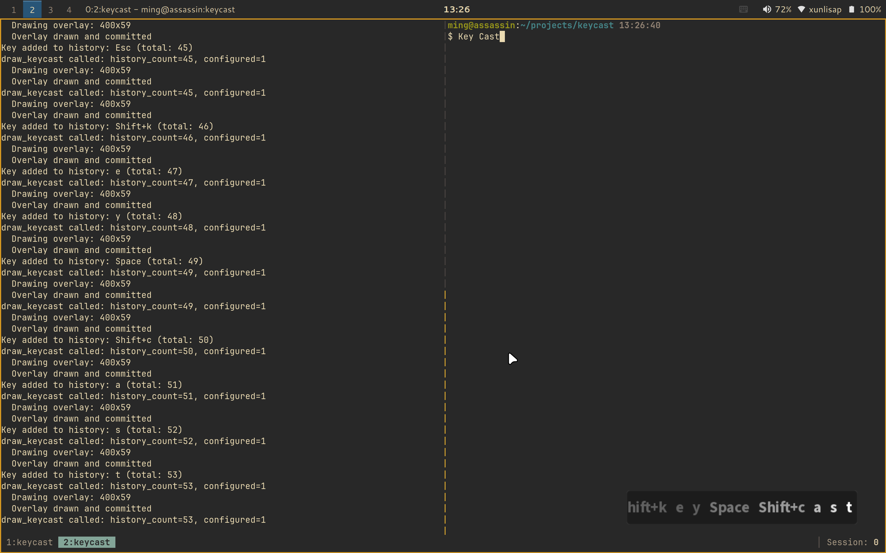

# Keycast

A lightweight Wayland overlay application that displays your keypresses in real-time on screen.

## What is this?

Keycast is a keypress visualization tool for Wayland compositors that support the `wlr-layer-shell` protocol. It creates a transparent overlay that shows exactly what you're typing, including modifier keys (Ctrl, Alt, Shift, Super) and key combinations. Perfect for:

- Screen recordings and tutorials
- Live coding demonstrations
- Presentations
- Debugging keyboard input

The overlay runs in the background without stealing focus, capturing keypresses directly from input devices using `libevdev`.

## Screenshot



## Features

- **Real-time display**: Shows keypresses as you type, including auto-repeat
- **Background operation**: Captures input without stealing focus from other applications
- **Modifier key support**: Displays combinations like `Ctrl+c`, `Alt+Tab`, `Super+d`
- **Customizable position**: 9-point grid positioning (top-left, center, bottom-right, etc.)
- **Configurable margin**: Adjust distance from screen edges
- **Dynamic width**: Grows with content, capped at maximum width with overflow hidden
- **Key history**: Shows recent keypresses with fade effect (up to 100 keys)
- **Transparent overlay**: Semi-transparent background with rounded corners

## Dependencies

### Build Dependencies

```bash
# Void Linux
sudo xbps-install -S base-devel wayland-devel cairo-devel pango-devel libevdev-devel

# Arch Linux
sudo pacman -S base-devel wayland cairo pango libevdev

# Ubuntu/Debian
sudo apt install build-essential libwayland-dev libcairo2-dev libpango1.0-dev libevdev-dev wayland-protocols
```

### Runtime Dependencies

- A Wayland compositor with `wlr-layer-shell-unstable-v1` support (e.g., Sway, Hyprland, niri, river)
- Read access to `/dev/input/event*` devices

## User Groups

To capture keyboard input, your user needs to be in the `input` group:

```bash
# Add your user to the input group
sudo usermod -a -G input $USER

# Log out and log back in for the change to take effect
```

Alternatively, you can run keycast with `sudo`, but adding yourself to the `input` group is recommended.

## Build and Install

### Compile

```bash
cd /home/ming/projects/keycast
make
```

The compiled binary will be `./keycast`.

### Install (Optional)

```bash
# Install to /usr/local/bin
sudo install -Dm755 keycast /usr/local/bin/keycast

# Or install to ~/.local/bin (user-local, no sudo needed)
install -Dm755 keycast ~/.local/bin/keycast
```

## Usage

### Basic Usage

```bash
./keycast
```

This starts keycast with default settings (bottom-right corner, 20px margin).

### Command-Line Options

```bash
./keycast [options]

Options:
  -p, --position POSITION  Set display position (default: bottom-right)
                           Valid values:
                           top-left, top-center, top-right,
                           center-left, center, center-right,
                           bottom-left, bottom-center, bottom-right
  -m, --margin PIXELS      Set margin in pixels (default: 20)
  -h, --help               Show help message

Examples:
  ./keycast --position top-right --margin 50
  ./keycast -p bottom-left -m 30
  ./keycast -p center -m 10
```

### Running

1. Make sure you're in the `input` group (see User Groups section above)
2. Start keycast: `./keycast -p top-right -m 20`
3. The overlay will appear when you press keys
4. Press `Ctrl+C` in the terminal to exit

## Configuration

Keycast behavior can be customized by editing the constants in `main.c` before compiling:

```c
#define FONT_DESC "Sans Bold 20"     // Font style and size
#define PADDING 10                   // Internal padding
#define BACKGROUND_ALPHA 0.3         // Background transparency (0.0-1.0)
#define CORNER_RADIUS 6.0            // Rounded corner radius
#define KEY_HISTORY_SIZE 100         // Maximum keys in history
#define MAX_WIDTH 400                // Maximum overlay width in pixels
```

After changing these values, run `make clean && make` to rebuild.

## Troubleshooting

### "No keyboard devices found"

Make sure:
1. You're in the `input` group: `groups | grep input`
2. You've logged out and back in after adding yourself to the group
3. Or run with `sudo ./keycast` as a temporary workaround

### "Missing required Wayland interfaces"

Your compositor doesn't support `wlr-layer-shell-unstable-v1`. This protocol is supported by:
- ✅ Sway
- ✅ Hyprland
- ✅ niri
- ✅ river
- ❌ GNOME Wayland (not supported)
- ❌ KDE Plasma Wayland (not supported)

### Overlay not appearing

1. Check if keycast is running: The terminal should show "Keycast started successfully"
2. Try pressing some keys - the overlay only appears when keys are pressed
3. Try a different position: `./keycast -p center`

## License

This program is free software: you can redistribute it and/or modify it under the terms of the GNU General Public License as published by the Free Software Foundation, either version 3 of the License, or (at your option) any later version.

This program is distributed in the hope that it will be useful, but WITHOUT ANY WARRANTY; without even the implied warranty of MERCHANTABILITY or FITNESS FOR A PARTICULAR PURPOSE. See the GNU General Public License for more details.

You should have received a copy of the GNU General Public License along with this program. If not, see <https://www.gnu.org/licenses/>.

## Contributing

Contributions are welcome! Feel free to:
- Report bugs
- Suggest features
- Submit pull requests

## Credits

Built with:
- Wayland client library
- Cairo graphics library
- Pango text rendering library
- libevdev for input device access
- wlr-layer-shell protocol from wlroots
